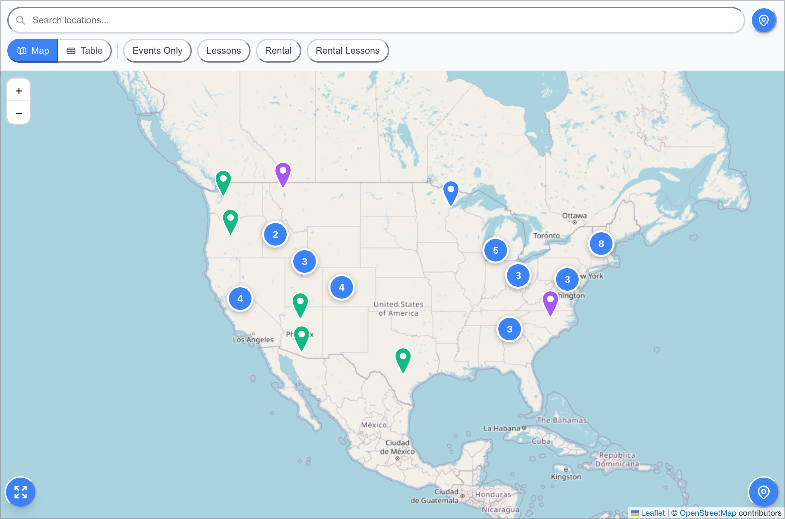

<p align="center">
  
</p>

<h1 align="center">OpenMapEmbed</h1>

<p align="center">
An embeddable, customizable location map widget with dynamic category support and Google Sheets integration.
</p>

<p align="center">
  <a href="https://foobarnes.github.io/open-map-embed/">
    
  </a>
  <a href="./dist">
    
  </a>
  <a href="LICENSE">
    
  </a>
</p>

<p align="center">
  
</p>


## ✨ Features

- 🎨 **Dynamic Categories** - Auto-discovers categories from data with 8-color palette
- 📊 **Google Sheets Integration** - Use any Google Sheet as your data source
- 🗺️ **Interactive Maps** - Leaflet-powered with clustering and geolocation
- 🖼️ **Image Galleries** - Display location photos in tooltips and table view
- 📱 **Fully Responsive** - Works on any device, height controlled by container
- 🔍 **Powerful Filters** - Search, category, and distance-based filtering
- 📋 **Table View** - Alternate view with pagination
- ⚡ **Lightweight** - Only 218 KB gzipped
- 🚀 **Easy Setup** - No API keys required, just 3 lines of code

## 🚀 Quick Start

### CDN (Simplest)

Hosted on GitHub Pages - automatically updated on every push to main:

```html
<!DOCTYPE html>
<html>
<head>
  <meta charset="UTF-8">
  <meta name="viewport" content="width=device-width, initial-scale=1.0">
  <title>My Location Map</title>
</head>
<body>
  <!-- Container for the map widget -->
  <div id="map" style="height: 600px;"></div>

  <!-- Load widget script (CSS is automatically included) -->
  <script src="https://foobarnes.github.io/open-map-embed/dist/open-map-embed.umd.js"></script>
  <script>
    OpenMapEmbed.init({
      container: '#map',
      dataSource: {
        type: 'google-sheets-public',
        sheetId: 'YOUR_SHEET_ID'
      },
      config: {
        theme: 'light',
        defaultView: 'map'
      }
    });
  </script>
</body>
</html>
```

### NPM

```bash
npm install open-map-embed
# or
pnpm add open-map-embed
```

```javascript
import { init } from 'open-map-embed';
// CSS is automatically included - no import needed!

init({
  container: '#map',
  dataSource: {
    type: 'google-sheets',
    sheetId: 'YOUR_SHEET_ID',
    apiKey: 'YOUR_API_KEY'
  }
});
```

## 📚 Documentation

- **[Embedding Guide](./docs/embedding-guide.md)** - Complete integration guide with examples
- **[Google Sheets Template](./docs/google-sheets-template.md)** - Set up your data source
- **[Live Demo](https://foobarnes.github.io/open-map-embed/)** - See it in action

## 🎨 Category Customization

Categories are auto-discovered from your data! Just add any category names to your Google Sheet and they'll automatically get colors.

### Default Behavior
```javascript
// Categories auto-discovered: ambassador, rental, trail
// Automatically assigned: Blue, Green, Orange
```

### Custom Colors
```javascript
init({
  // ...
  config: {
    categoryConfig: {
      'Restaurant': {
        color: '#FF5733',
        bg: 'lmw-bg-yellow-100',
        text: 'lmw-text-yellow-800'
      },
      'Hotel': {
        color: '#3498db'
      }
    }
  }
});
```

## 🛠️ Development

```bash
# Install dependencies
pnpm install

# Start dev server
pnpm dev

# Build for production
pnpm build

# Preview production build
pnpm preview
```

## 📦 Project Structure

```
open-map-embed/
├── src/
│   ├── components/     # React components
│   ├── adapters/       # Data source adapters
│   ├── stores/         # Zustand state management
│   ├── utils/          # Utilities (including category auto-discovery)
│   └── types/          # TypeScript definitions
├── docs/               # Documentation
├── dist/               # Build output
└── demo.html           # GitHub Pages demo
```

## 🚢 GitHub Pages Deployment & CDN

This project uses GitHub Pages for both the demo site and as a CDN for the widget files:

**Demo Site**: `https://foobarnes.github.io/open-map-embed/`
**CDN URLs**:
- CSS: `https://foobarnes.github.io/open-map-embed/dist/open-map-embed.css`
- JS: `https://foobarnes.github.io/open-map-embed/dist/open-map-embed.umd.js`

### Setup

1. **Enable GitHub Pages**:
   - Go to Repository Settings > Pages
   - Source: "GitHub Actions"

2. **Push to main branch**:
   ```bash
   git push origin main
   ```

3. **Automatic deployment**:
   - GitHub Actions will build and deploy
   - Files are automatically available via CDN
   - Updates within minutes of pushing to main

The workflow (`.github/workflows/deploy.yml`) automatically:
- Builds the library
- Creates demo site with built assets
- Deploys to GitHub Pages (serving as CDN)

### PR Preview Builds

Pull requests automatically trigger a preview build via `.github/workflows/pr-preview.yml`:
- Builds the demo site for the PR
- Uploads as a downloadable artifact (available for 7 days)
- Posts a comment on the PR with download instructions

This allows you to test changes before merging to main.

## 🤝 Contributing

Contributions are welcome! Please feel free to submit a Pull Request.

## 📄 License

MIT License - see LICENSE file for details

## 🙏 Acknowledgments

Built for [Ablebodied.org](https://ablebodied.org) to help connect adaptive cycling communities.

## 💬 Support

- 📖 [Documentation](./docs/)
- 🐛 [Report Issues](https://github.com/foobarnes/open-map-embed/issues)
- 💡 [Feature Requests](https://github.com/foobarnes/open-map-embed/issues)

---

Made with ❤️ for the adaptive cycling community
